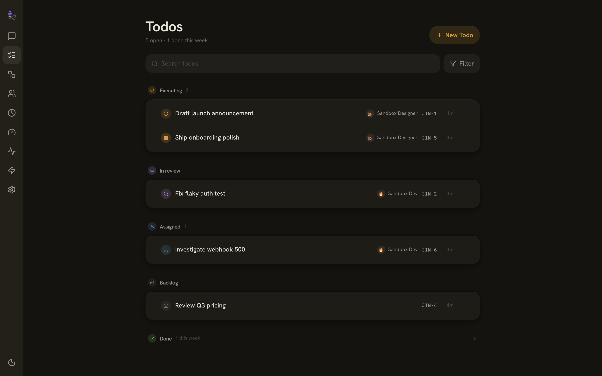
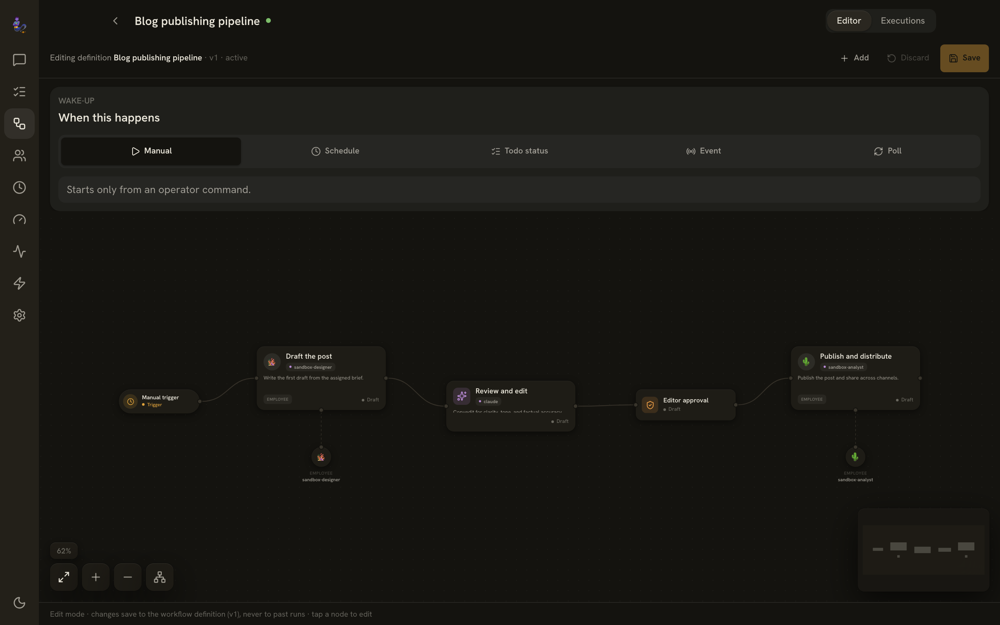
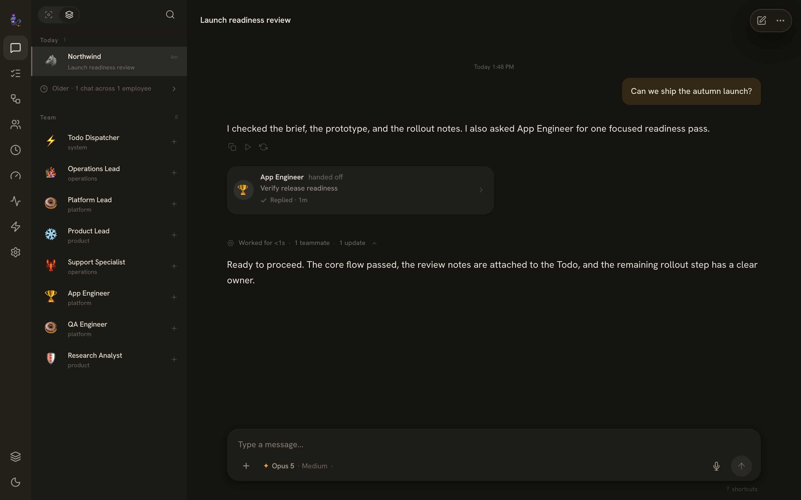
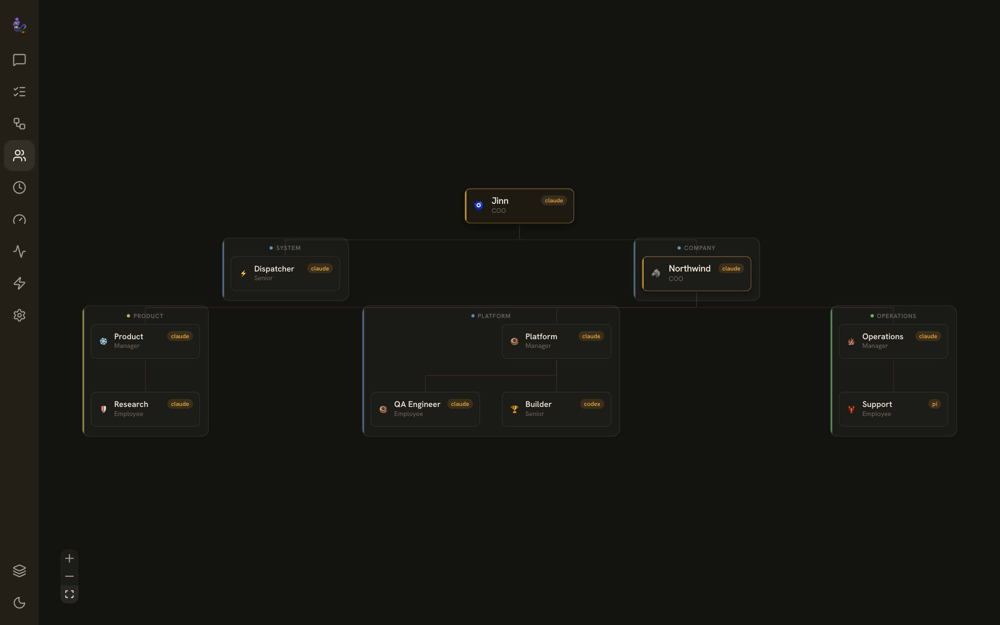

<h1 align="center">🧞 Jinn</h1>

<p align="center"><b>Run your AI agents as a company.</b></p>

<p align="center">
  Jinn turns the agent CLIs you already use - Claude Code, Codex, Grok, Hermes - into a persistent AI company:
  named employees, a durable Todo ledger, and reusable Workflows,
  all operated from a chat and web dashboard.<br/>
  It doesn't replace your agents. <b>It gives them an org to work in.</b>
</p>

<p align="center">
  <a href="https://www.npmjs.com/package/jinn-cli"></a>
  <a href="LICENSE"></a>
  
  
</p>

<p align="center">
  
</p>

> **You bring the engines. Jinn runs the company.**

---

## Why Jinn?

You've already installed the best agent CLIs. On their own they're a pile of terminals with no memory of each other. Jinn turns them into a company that keeps working, keeps track, and keeps records.

- **🎼 Conducts your agents - doesn't replace them.** Claude Code, Codex, Grok, Hermes, Pi - whatever's on your `PATH` becomes a Jinn engine. Jinn adds no AI logic of its own ("bus, not brain"); all the intelligence is your engines'. When they get better, Jinn gets better, for free.
- **🏢 A real org you design in YAML.** Named employees with personas, ranks, and departments, and a reporting hierarchy of any depth. A COO delegates work to managers, managers to their reports. A real chain of command, not a flat pool of anonymous agents.
- **🛠️ Employees work through one company surface (MCP).** A built-in Jinn MCP gives every engine a typed set of "hands" for org and sessions, delegation, Todos, Workflows, Notes, cron, and connectors. Employees operate the company in company terms instead of poking at the platform underneath.
- **📋 Todos are the durable work ledger.** Work is tracked, assigned, prioritized, and reviewer-closed - not lost when a session ends. Delegation is bound to a Todo, so who owns what and what's still open survives across days and restarts.
- **🔁 Workflows are a real automation engine.** Author reusable graph workflows with sequential, conditional, parallel, and switch paths, per-phase engine and model choices, native approvals, and durable run history. Triggers bind schedules, webhooks, polls, and Todo-status events to a procedure.
- **⏰ Works while you sleep, with receipts.** Hot-reloadable cron runs background research, content, monitoring, and support, routed through your COO for review. Delegations, callbacks, and Workflow runs show up as structured activity in Chat, so you can see what happened, not just the final answer.
- **📦 Skills, Notes, and connectors - shared across the org.** Reusable Markdown skill playbooks every engine follows natively, an Apple Notes-style knowledge workspace, and Slack, WhatsApp, Discord, and Telegram connectors. The institutional layer a lone agent can't keep.

> Jinn is **beta**. It moves fast and works today; expect sharp edges and read the upgrade notes when you bump versions.

---

## Quickstart

> **Prerequisites:** Node.js **22 or 24** (avoid 25 for now), and at least one agent CLI installed **and signed in**. Jinn orchestrates your engines and can't run a session without one.

```bash
# 1. Install Jinn
npm install -g jinn-cli

# 2. Install + sign in to at least one engine (example: Claude Code)
npm install -g @anthropic-ai/claude-code
claude            # run once, use /login, then quit

# 3. Set up ~/.jinn (probes your engines, writes config, seeds your company)
jinn setup

# 4. Start the gateway - opens the dashboard for you
jinn start
```

Then open **[http://localhost:7777](http://localhost:7777)**, send your first message, and watch your COO delegate the work.

Or install via **Homebrew**:

```bash
brew tap hristo2612/jinn https://github.com/hristo2612/jinn
brew install jinn
jinn setup && jinn start
```

> **`--version` ≠ signed in.** Jinn drives the official engine CLIs, so authenticate each one *before* `jinn start` (run `claude` → `/login`, run `codex` to sign in, and so on). Without this, sessions can't reach the models - the most common fresh-install gotcha.

Everyday commands:

```bash
jinn start      # start the gateway daemon (auto-opens the dashboard)
jinn stop       # stop it
jinn restart    # restart safely (detached; works even from inside a session)
jinn status     # is the daemon running?
```

Already running an older version? After upgrading, run **`jinn migrate`** and let your COO apply the composed migration prompt - it merges the latest operating doctrine into your instance without overwriting your personal customizations.

---

## The company model

Jinn gives you a small set of building blocks. You place them like Lego, and the gateway handles the machinery underneath. The company metaphor is the whole interface.

**Employees** are your AI roles. Each is a plain YAML persona with a name, a department, a rank, and an engine (Claude Code, Codex, Grok, Hermes, and so on). One employee can run several sessions at once, and different employees can run on different engines, so you match the model to the job. They live as editable files in `~/.jinn/org/`.

**Todos** are the durable work ledger. Every piece of owned work is a ticket with an assignee, a priority, and a status. Delegating a task creates a Todo; a cron fire or a workflow can create one too. Employees pick up their assigned tickets, move finished work to review, and reviewers, not the producer, close it. Completion is earned through review, not assumed the moment a session ends. Filters, ranking, manual start and cancel, approval requests, and archival are all built in.

<div align="center">
  
</div>

**Workflows** are a real automation engine, not a checklist. You author a reusable graph procedure with sequential, conditional, parallel, and switch paths. Each phase can set its own engine, model, effort, and prompt overrides. Runs are idempotent, keep evidence, report back, and can be cancelled, with a durable execution history you can inspect. Human approvals are first-class gates inside a run. Workflows start on demand or fire from **Triggers**: schedules, webhooks, polls, and Todo-status changes, with hardened validation.

<div align="center">
  
</div>

**Chat** is how you operate the company. You talk to your COO or any employee in plain language, and the work you set in motion shows up as **activity receipts**: delegations, callbacks, follow-ups, Todo changes, and Workflow operations render as structured, durable events with previews and deep links, right in the conversation. Live turn evidence folds cleanly into the final answer, so you can always see what actually happened.

<div align="center">
  
</div>
<div align="center"><sub>An employee on the Engineering team triages a flaky test, ships the fix, and opens a PR, with each delegation and callback rendered as an activity receipt.</sub></div>

**Notes, Skills, and Cron** are the supporting surfaces. Notes are Markdown knowledge the org keeps and reuses, with folders, search, and dictation. Skills are reusable playbooks every engine follows natively. Cron schedules recurring work in the background. All three are editable documents you own on disk.

### The MCP company surface

Under the hood, a built-in **Jinn MCP** gives every engine a typed set of hands for the company. Instead of driving the platform with raw HTTP or guesswork, employees call tools for org and employees, sessions and delegation, Todos, Workflows and Triggers, approvals, Notes, cron, cost reads, connectors, and managed files. Tool discovery is compact and capability-scoped, so an employee gets the right hands for the moment without carrying the entire platform manual in every turn. Shell and filesystem access stay available for local implementation work the MCP does not cover.

---

## How it works

Jinn is a **local gateway daemon plus a web dashboard**. Everything runs on your machine.

- **The gateway** dispatches each task to an engine, tracks sessions and Todos, runs Workflows and cron, manages connectors, and serves the dashboard at `localhost:7777`.
- **Engines are your employees.** Any agent CLI on your `PATH` becomes an interchangeable engine. Jinn adds no AI logic of its own, so all the intelligence is your engines'. Pick engine, model, and effort per employee or per session.
- **The dashboard and Chat** are where you watch and steer: chat with employees, browse the Todos ledger, edit Workflows on the canvas, read the org map, and see live streaming turns.
- **Delegation and callbacks** connect sessions. Any session can spawn child sessions bound to a Todo. When a child finishes, it reports back to its parent through a persisted, restart-safe callback, so a COO can fan a task out, then synthesize one answer.

```
                          +----------------+
                          |    jinn CLI    |
                          +-------+--------+
                                  |
                          +-------v--------+
                          |    Gateway     |
                          |     Daemon     |
                          +--+--+--+--+----+
                             |  |  |  |
              +--------------+  |  |  +--------------+
              |                 |  |                 |
      +-------v---------+ +-----v------+  +---------v-----+
      |     Engines     | | Connectors |  |    Web UI     |
      | claude · codex  | | Slack · WA |  | localhost:7777|
      | grok · hermes…  | | Discord·TG |  |               |
      +-------+---------+ +-----+------+  +-------+-------+
              |                                   |
      +-------v-------+   +-----------+   +--------v-------+
      |  Todos ·      |   |   Cron    |   |  Jinn MCP      |
      |  Workflows    |   | Scheduler |   |  company hands |
      +---------------+   +-----------+   +----------------+
```

The Claude engine runs inside a real interactive terminal, so its turns bill against your flat-rate Max/Pro subscription instead of a token meter. Other engines use a simpler spawn-per-turn or streaming model. Jinn asks each CLI what it can do at boot, so there is no version pinning and new models show up the moment your CLI learns them.

---

## The org system

Employees are plain YAML files in `~/.jinn/org/`. Each has a persona, a rank, a department, an engine, and a place in the hierarchy:

```yaml
name: research-lead
displayName: Research Lead
department: research
rank: manager
engine: claude
model: opus
reportsTo: chief-of-staff      # hierarchy of any depth
persona: |
  You lead market research. Break briefs into parallel sub-tasks,
  delegate to your analysts, and synthesize one clear answer.
```

**Ranks and reporting lines.** Ranks (executive, manager, senior, employee) set default reporting lines; `reportsTo` overrides them for any depth you like. Same-rank employees never implicitly report to each other. The result is a real chain of command: the COO delegates to managers, managers delegate to their reports, and you watch the whole tree light up live.

**Delegation through managers.** Work flows down the hierarchy. A manager decomposes a brief, hands sub-tasks to their reports as Todos, and rolls the results back up. You still reach any employee directly when you want to.

**Oversight levels.** Reviewers apply an oversight level to the work coming back: TRUST relays it directly, VERIFY spot-checks it, and THOROUGH does a full review with follow-ups. Fresh work handles itself in its own lane; only money, irreversible actions, public actions, or legal and security risk route up to you.

<div align="center">
  
</div>

---

## Engines - bring your own

Jinn detects whichever agent CLIs are on your `PATH` and makes them interchangeable engines. Switch per session or per employee in the dashboard; engines whose binary isn't installed are simply hidden. **No version pinning, no bundled model lists** - Jinn asks each CLI what it can do at boot, so the moment your CLI learns a new model, Jinn offers it.

| Engine | What it is | Install | Modes | Effort |
|--------|-----------|---------|-------|--------|
| **claude** | Anthropic Claude Code - first-party, subscription-friendly | `npm install -g @anthropic-ai/claude-code` | Chat (PTY + live stream) · CLI (xterm) | low / medium / high |
| **codex** | OpenAI Codex CLI | `npm install -g @openai/codex` | Chat · CLI (xterm) | low / medium / high / xhigh |
| **grok** | xAI Grok CLI | `npm install -g @xai-official/grok` (run `grok` once to auth) | Chat · CLI (xterm) | low / medium / high / xhigh / max |
| **antigravity** | Antigravity CLI (`agy`) | see Antigravity docs | CLI (xterm) | - |
| **pi** | Pi coding agent CLI | see Pi CLI docs | Chat | - |
| **hermes** | NousResearch Hermes - open-source, model-agnostic agent | `curl -fsSL https://hermes-agent.nousresearch.com/install.sh \| bash` | Chat (ACP streaming) · CLI (xterm view) | - |

The picker shows real model names out of the box (Opus 4.8, GPT-5.5, Gemini 3.x…). Those labels live in your `config.yaml`, so a fresh install looks polished day one - while Grok, Pi, and Hermes report their model lists live at session start.

> **Hermes cost note.** Unlike the subscription-wrapped engines, Hermes owns its own model loop and bills **per token** on the provider configured in `~/.hermes`. It streams over the Agent Client Protocol (ACP) and runs fully auto-approved. See [`docs/engines-hermes.md`](docs/engines-hermes.md).

<details>
<summary><b>How the Claude engine runs on your subscription</b> (the PTY details)</summary>

Jinn drives the **real interactive `claude` binary inside a [node-pty](https://github.com/microsoft/node-pty) pseudo-terminal** - byte-for-byte identical to typing `claude` at your shell - so Anthropic's billing pipeline counts it against your Max/Pro subscription rather than your API credit pool. Every Claude turn (cron, Slack, web Chat, web CLI) flows through one path:

- **Hooks for turn boundaries.** A per-session settings file registers Claude Code's `SessionStart` / `Stop` / `PreToolUse` / `PostToolUse` hooks; a tiny relay POSTs each event back to the daemon over loopback, so it knows exactly when a turn starts, finishes, or hits a rate limit - no screen-scraping.
- **Real streaming.** The PTY's `claude` is pointed at a per-session loopback proxy via `ANTHROPIC_BASE_URL`; Jinn intercepts the model's own SSE stream and forwards it to the UI word-by-word.
- **One process, two views.** The dashboard's Chat ↔ CLI toggle is two views of the *same* PTY: Chat renders the parsed stream, CLI attaches `xterm.js` to the live terminal.
- **Exact cost.** At turn end the daemon sums token usage straight from Claude Code's own transcript JSONL.
- **Durable snapshots.** Interactive PTYs serialize their terminal state, so a live session restores across browser reconnects and gateway restarts instead of losing scrollback.

Codex, Grok, and Pi use a simpler spawn-per-turn model; Hermes streams over ACP. They don't have Claude's subscription-billing wrinkle, so they don't need a PTY.

</details>

---

## Features

Highlights from **0.26**, where Jinn grows from an orchestration layer into a full company operating system:

- **🔌 Six engines, one picker** - Claude Code, Codex, Grok, Antigravity, Pi, Hermes; pick engine + model + effort per session or per employee, switchable mid-chat.
- **🏢 AI org system** - employees, departments, ranks, managers, and a reporting hierarchy of any depth, all in editable YAML.
- **🧩 Real delegation** - parent/child sessions with persisted, restart-safe callbacks and a COO-review pattern that filters noise before it reaches you.
- **📋 Todos - the durable work ledger** - assignment, priorities, ranking, approval requests, manual start/cancel, archival, and manager visibility. Delegation is task-bound and completion is reviewer-driven, not disposable session state.
- **🔀 Workflow engine** - author reusable graph workflows with sequential, conditional, parallel, and switch paths; per-phase engine/model/effort and prompt overrides; native approvals; idempotent runs; evidence; and durable run history. A visual LTR canvas editor with a node inspector and live run status ships in the web app.
- **⏰ Triggers & cron** - schedules, webhooks, polls, and Todo-status events bind to workflows; hot-reloadable background jobs keep run history and optional failure alerts.
- **🛠️ Company surface over MCP** - a built-in Jinn MCP gives every capable engine a typed surface for org, sessions, delegation, Todos, Workflows, Triggers, approvals, Notes, cron/cost reads, connectors, and files. Discovery is compact and capability-scoped, so employees get the right hands without the whole platform manual each turn.
- **🗒️ Notes (opt-in)** - an Apple Notes-style workspace with folders, search, Markdown editing, and dictation, backed by MCP note operations. Enable it with `gateway.notesEnabled`; the existing git-backed knowledge base stays available either way.
- **🧾 Activity receipts in Chat** - delegations, callbacks, follow-ups, Todo mutations, and Workflow operations render as structured, durable activity with previews and deep links; live turn evidence folds cleanly into the final answer.
- **📦 Skills** - reusable markdown playbooks auto-synced into the underlying CLIs and browsable/editable as raw `SKILL.md`; install community skills with one command.
- **💬 Connectors** - Slack (threads + ✅ reaction approvals), Discord, Telegram (with voice notes), WhatsApp.
- **🌐 Web dashboard** - chat, interactive org map, Todos, Workflows, cron, Notes, skills catalog, usage & limits, activity logs, and settings, with a calmer responsive layout and stronger mobile behavior.
- **🖥️ Chat or raw terminal** - toggle any session between rendered chat and a live `xterm` view of the engine.
- **📎 Attachments** - drag, drop, or paste files and images into chat; passed through to the engine and rendered inline.
- **🎙️ Voice** - push-to-talk dictation (local Whisper) and a hands-free "Talk" mission-control mode with streaming TTS.
- **💰 Cost governance** - per-employee monthly budgets and per-session cost/time caps.
- **🔄 Hot-reload & self-modification** - edit config, cron, org, or skills and the daemon reloads live; agents can edit those files too.
- **🚚 Version-aware migrations** - `jinn migrate` composes only the guidance your installed version needs, preserves your customized instance files, and stamps YAML safely.

See [CHANGELOG.md](CHANGELOG.md) for the full 0.26 notes.

---

## What people build with it

- **A Slack bot that actually ships work** - @mention an employee, it codes, and reports back in-thread.
- **An always-on content pipeline** - cron jobs research, draft, fact-check, and publish on a schedule, reviewed by a COO.
- **A support desk** - inbound tickets triaged by an employee, with human ✅ approval before any reply goes out.
- **A research org** - a manager fans a question out to analysts in parallel, then synthesizes one answer.
- **A repeatable ops runbook** - encode a multi-step procedure as a Workflow with approval gates, then trigger it on a schedule or a webhook and keep the run history.

---

## Configuration

Jinn reads `~/.jinn/config.yaml`. A minimal file only needs `engines.claude`; everything else falls back to sensible defaults:

```yaml
gateway:
  port: 7777
  host: "127.0.0.1"
  # notesEnabled: true       # opt in to the Notes workspace (optional)

engines:
  default: claude            # claude | codex | grok | antigravity | pi | hermes
  claude:
    bin: claude              # binary on your PATH (override to point elsewhere)
    model: opus
    effortLevel: medium
  codex:
    bin: codex
    model: gpt-5.5
    effortLevel: high

mcp:
  gateway:
    enabled: true            # built-in Jinn company surface for employees
  fetch:
    enabled: true
  search:
    enabled: false           # set true and add a Brave key to enable web search

connectors:
  slack:
    shareSessionInChannel: false
    ignoreOldMessagesOnBoot: true

sessions:
  maxDurationMinutes: 30
  maxCostUsd: 10.00
```

- **Engines** point at a CLI `bin` and a default `model`; `engines.default` selects which one new sessions use. `claude` and `codex` ship in the default config; `grok`, `antigravity`, `pi`, and `hermes` are optional blocks you add when you install those CLIs.
- **Cron jobs** live in `~/.jinn/cron/jobs.json` (hot-reloaded).
- **Employees** live as YAML files in `~/.jinn/org/` (registry rebuilds on change).
- **Skills** live in `~/.jinn/skills/<name>/SKILL.md`.
- **Workflows** need no new config key. Run evidence defaults to `<JINN_HOME>/workflow-evidence` and can be relocated with the optional `JINN_WORKFLOW_EVIDENCE_ROOT` environment variable.

Everything is human-readable files you own - `cat` it, edit it, commit it. Upgrading from an earlier version? Run **`jinn migrate`** and let your COO apply the composed prompt - it merges the latest operating doctrine into your customized instance without touching your personal instructions.

---

## Roadmap

Jinn is in active development (honest beta). Shipped recently:

- **Company operating system** - the Todos work ledger, the Workflow engine with a visual editor, Triggers, and the MCP company surface.
- **Six-engine support** and mid-chat engine switching.
- **Notes workspace**, first-class Skills and Cron documents, and activity receipts in Chat.
- File attachments, in-app file viewer, agent-to-agent messaging, shared memory, mobile UI, and live streaming.

On deck:

- **Engines** - local models (Ollama / llama.cpp), engine fallback chains.
- **Connectors** - iMessage, email (IMAP/SMTP), generic webhooks.
- **Dashboard** - approve/reject agent actions from the UI, per-employee cost analytics.
- **Platform** - installable plugins, REST API auth, multi-user roles, Docker image.
- **Skills** - community marketplace, versioning, scaffolding templates.

Want to suggest something? [Open an issue](https://github.com/hristo2612/jinn/issues).

---

## Development

Jinn is a pnpm + turbo monorepo.

```bash
git clone https://github.com/hristo2612/jinn.git
cd jinn
pnpm install
pnpm setup   # one-time: builds all packages and creates ~/.jinn
pnpm dev     # gateway (:7777) + Vite dev server (:5173) with hot reload
```

Open **[http://localhost:5173](http://localhost:5173)** - Vite proxies `/api` and `/ws` to the gateway.

Useful scripts:

```bash
pnpm build       # build every package (turbo) and sync web assets
pnpm test        # run the test suites across packages
pnpm typecheck   # type-check without emitting
pnpm lint        # lint every package
pnpm test:e2e    # Playwright end-to-end tests
```

> **Prerequisites:** Node.js **24.13.0** (the repo pins it via `.nvmrc` + `engine-strict`; native modules like `better-sqlite3` are ABI-locked), pnpm **10.6+**, and at least one engine CLI. See [CONTRIBUTING.md](.github/CONTRIBUTING.md) for the full setup.

---

## License

[MIT](LICENSE)

## Contributing

See [CONTRIBUTING.md](.github/CONTRIBUTING.md) for setting up your environment and submitting pull requests.
